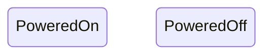
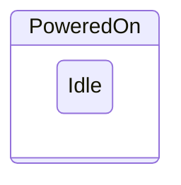

# asyncio-state-pattern

Python package for writing async state machines following the [state pattern]
(https://en.wikipedia.org/wiki/State_pattern). Compatible with Python 3.8 and
later.

- [Features](#features)
- [Quick Start](#quick-start)
- [Overview](#overview)
    * [States](#states)
    * [State Machines](#state-machines)
    * [Initial States](#initial-states)
    * [Transitions](#transitions)
    * [Entry and Exit Actions](#entry-and-exit-actions)
    * [Events](#events)

## Features

- Supports state nesting for hierarchical state machines

## Quick Start

Install via pip:

```sh
pip install asyncio-state-pattern
```

Create a Python script with the following code:

```python
import asyncio
from asyncio_state_pattern import State, StateMachine

class InitialState(State):
    def greet(self):
        print(f"Hello from {self.name}!")

class Greeter(StateMachine):
    def __init__(self):
        super().__init__(states=[InitialState])

    def greet(self):
        self.state.greet()

async def main():
    greeter = Greeter() # State is initially `None`
    await greeter.start() # State set to `InitialState`
    greeter.greet() # Prints "Hello from InitialState!"

asyncio.run(main())
```

Running this script will output `Hello from InitialState!` to the terminal.

## Overview

### States

States are modelled as classes that sub-class the `State` class:


```python
class PoweredOn(State):
    ...
class PoweredOff(State):
    ...
```

State classes can be further sub-classed to model nested states for hierarchical
state machines:


```python
# `Idle` is a sub-state of `PoweredOn`
class Idle(PoweredOn):
    ...
```

### State Machines

The state pattern's `Context` class is implemented as a sub-class of `StateMachine`.
This class is used to define the set of internal states that the class can enter.

```python
class CoffeeMaker(StateMachine):
    def __init__(self):
        super().__init__(states=[PoweredOff, PoweredOn, Idle])
    ...
```

In this example, `PoweredOn` is a composite state with the sub-state `Idle`.
Composite states may be omitted during initialization as they are inferred from
their sub-states, so `PoweredOn` may be removed:

```python
class CoffeeMaker(StateMachine):
    def __init__(self):
        super().__init__(states=[PoweredOff, Idle]) # `PoweredOn` inferred from `Idle`
    ...
```

When the `StateMachine` is initialized it creates instances of each state
sub-class that was given. These instances are retained for the lifetime of the
`StateMachine` instance and are not re-created when exiting and re-entering a
state.

State instances may also be initialized manually with their own args:

```python
class PoweredOff(State):
    ...

class PoweredOn(State):
    def __init__(self, temperature):
        self.temperature = temperature
    ...

class CoffeeMaker(StateMachine):
    def __init__(self):
        super().__init__(states=[
            PoweredOff, # `PoweredOff` will be initialized without arguments
            Idle(temperature=32.0) # `Idle` initialized with arguments
        ])
    ...
```

### Initial States

By default, the initial state that will be entered when the state machine is
started is the first state given during initialization:

```python
class CoffeeMaker(StateMachine):
    def __init__(self):
        super().__init__(states=[
            PoweredOff, # <-- Initial state
            PoweredOn
        ])
    ...
```

This behavior may be changed by manually declaring the state class with the
`initial` argument set to `True`.

```python
class PoweredOff(State): ...
class PoweredOn(State, initial=True): ...

class CoffeeMaker(StateMachine):
    def __init__(self):
        super().__init__(states=[
            PoweredOff,
            PoweredOn # <-- Initial state
        ])
    ...
```

The `initial` argument is also re-used to identify the initial sub-state of
any composite states:

```python
class PoweredOn(State): ...
class Idle(PoweredOn): ...
class Heating(PoweredOn, initial=True): ...

class CoffeeMaker(StateMachine):
    def __init__(self):
        super().__init__(states=[
            Idle,
            Heating # <-- Initial state
        ])
    ...
```

### Transitions

### Entry and Exit Actions

### Events
